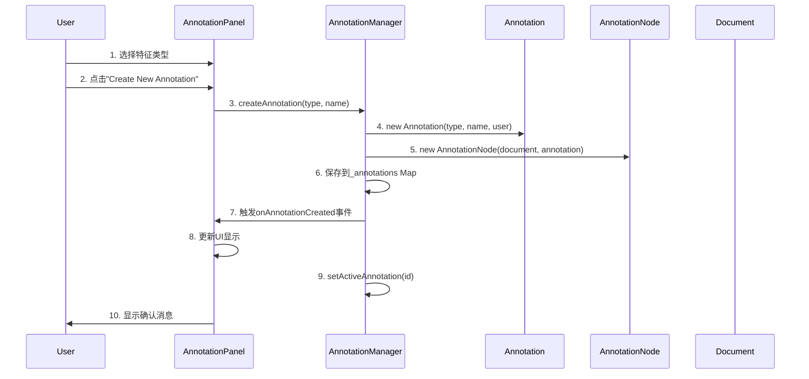
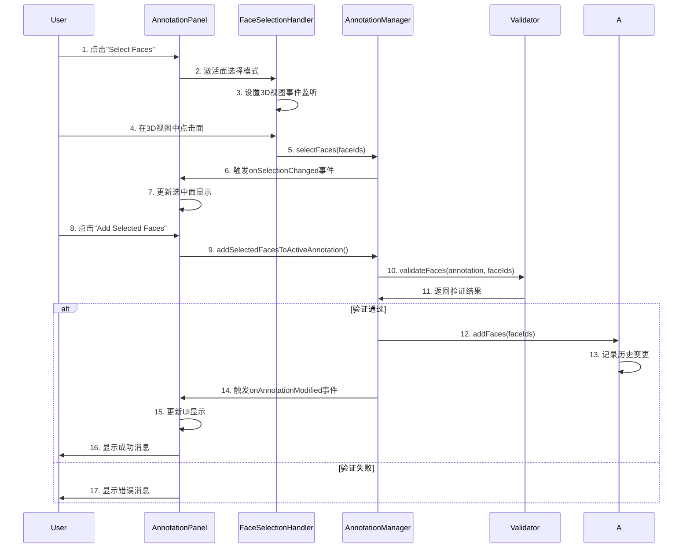

# BREP模型标注系统技术架构文档

## 系统概述

BREP模型标注系统（chili-annotation）是chili3d项目的扩展包，专门用于3D CAD模型的机加工特征标注。该系统支持27种标准机加工特征类型的识别、标注和验证，为学术研究（AAGNet格式）和工业应用（MFTRCAD格式）提供标准化数据导出。

### 核心功能

- **多特征类型支持**：支持孔、槽、台阶、凹槽等27种机加工特征
- **智能面选择**：直接点击多选，无需复杂操作
- **实时验证**：拓扑、几何和标注完整性验证
- **多格式导出**：AAGNet和MFTRCAD标准格式
- **历史追踪**：完整的操作历史记录
- **可视化反馈**：面高亮显示和交互式UI面板

## 架构设计

### 整体架构图

```
┌─────────────────────────────────────────────────────────┐
│                 chili-annotation 系统                    │
├─────────────────────────────────────────────────────────┤
│  UI层                                                   │
│  ┌─────────────────┐  ┌─────────────────────────────┐   │
│  │ AnnotationPanel │  │ FaceSelectionHandler        │   │
│  │ (标注面板)       │  │ (面选择处理器)                │   │
│  └─────────────────┘  └─────────────────────────────┘   │
├─────────────────────────────────────────────────────────┤
│  管理层                                                 │
│  ┌─────────────────────────────────────────────────────┐ │
│  │            AnnotationManager                        │ │
│  │            (标注管理器)                             │ │
│  └─────────────────────────────────────────────────────┘ │
├─────────────────────────────────────────────────────────┤
│  模型层                                                 │
│  ┌────────────┐  ┌────────────┐  ┌──────────────────┐  │
│  │Annotation  │  │AnnotationN │  │MachiningFeatureT │  │
│  │(标注实体)   │  │ode(节点)    │  │ype(特征类型)       │  │
│  └────────────┘  └────────────┘  └──────────────────┘  │
├─────────────────────────────────────────────────────────┤
│  验证层                                                 │
│  ┌──────────────┐ ┌────────────────┐ ┌──────────────┐  │
│  │TopologyValid │ │GeometryValidat │ │AnnotationVal │  │
│  │ator(拓扑验证) │ │or(几何验证)     │ │idator(标注验证)│  │
│  └──────────────┘ └────────────────┘ └──────────────┘  │
├─────────────────────────────────────────────────────────┤
│  导出层                                                 │
│  ┌─────────────────┐     ┌─────────────────────────┐    │
│  │ AAGNetExporter  │     │ MFTRCADExporter         │    │
│  │ (学术格式导出器) │     │ (工业格式导出器)         │    │
│  └─────────────────┘     └─────────────────────────┘    │
├─────────────────────────────────────────────────────────┤
│  命令层                                                 │
│  ┌─────────────────────────────────────────────────────┐ │
│  │          Command System Integration                 │ │
│  │     (与chili3d命令系统集成的各种标注命令)              │ │
│  └─────────────────────────────────────────────────────┘ │
└─────────────────────────────────────────────────────────┘
           │                    │                    │
           ▼                    ▼                    ▼
    ┌─────────────┐     ┌─────────────┐     ┌─────────────┐
    │ chili-core  │     │ chili-three │     │ chili-ui    │
    │(核心系统)    │     │(3D渲染)      │     │(UI组件)      │
    └─────────────┘     └─────────────┘     └─────────────┘
```

## 核心组件详解

### 1. 标注实体 (Annotation Class)

**文件**: `src/annotation.ts`

标注系统的核心数据模型，封装了机加工特征的所有信息。

```typescript
export class Annotation implements IDisposable {
    readonly id: string;                    // 唯一标识符
    private _type: MachiningFeatureType;    // 特征类型
    private _name: string;                  // 特征名称
    private _faces: Set<number>;            // 关联的面ID集合
    private _geometricParams: GeometricParams;    // 几何参数
    private _toleranceSpec: ToleranceSpec;        // 公差规范
    private _metadata: AnnotationMetadata;        // 标注元数据
    private _history: AnnotationRecord[];         // 操作历史
}
```

**关键特性**：
- 使用Set存储面ID，确保唯一性
- 完整的历史记录追踪
- 支持几何参数和公差规范
- 实现IDisposable接口，支持资源清理

### 2. 标注节点 (AnnotationNode Class)

**文件**: `src/annotationNode.ts`

扩展chili3d的Node系统，将标注实体集成到3D场景图中。

```typescript
export class AnnotationNode extends Node {
    private _annotation: Annotation;
    
    // chili3d属性装饰器集成
    @Serializer.serialze()
    @Property.define("annotation.featureType" as any)
    get featureType(): MachiningFeatureType { ... }
}
```

**集成要点**：
- 继承chili3d的Node类
- 使用@Property装饰器集成属性系统
- 支持序列化和克隆
- 响应可视化状态变更

### 3. 标注管理器 (AnnotationManager Class)

**文件**: `src/annotationManager.ts`

系统的核心管理器，负责标注的生命周期管理和状态协调。

```typescript
export class AnnotationManager implements IDisposable {
    private _document: IDocument;                    // 关联文档
    private _annotations = new Map<string, AnnotationNode>(); // 标注存储
    private _history = new AnnotationHistory();     // 历史管理
    private _validator: IAnnotationValidator;       // 验证器
    private _selectedFaces = new Set<number>();     // 选中面
    private _activeAnnotation: AnnotationNode | undefined; // 活动标注
}
```

**核心功能**：
- 标注的创建、删除、修改
- 面选择状态管理
- 历史操作的撤销/重做
- 事件系统（创建、修改、删除事件）
- 验证协调

### 4. 面选择处理器 (FaceSelectionHandler Class)

**文件**: `src/ui/faceSelectionHandler.ts`

处理3D视图中的面选择交互，支持多种选择模式。

```typescript
export class FaceSelectionHandler {
    private _selectionMode = FaceSelectionMode.Single;
    private _highlightedFaces = new Set<number>();
    
    // 选择模式
    export enum FaceSelectionMode {
        Single = "single",      // 单选
        Multiple = "multiple",  // 多选
        Range = "range"         // 范围选择
    }
}
```

**交互特性**：
- 支持单选、多选、范围选择
- 键盘快捷键支持（Ctrl+A全选，Ctrl+I反选，Esc清除）
- 实时视觉反馈
- 面悬停效果

### 5. 标注面板 (AnnotationPanel Class)

**文件**: `src/ui/annotationPanel.ts`

主要的用户界面，提供完整的标注操作界面。

**UI组件结构**：
```
┌─────────────────────────────────┐
│ BREP Model Annotation           │
│ Machining Feature Annotation    │
├─────────────────────────────────┤
│ Feature Type: [下拉选择器]       │
├─────────────────────────────────┤
│ Active Annotation:              │
│ ┌─────────────────────────────┐ │
│ │ 标注信息显示区域              │ │
│ └─────────────────────────────┘ │
│ ┌─────────────────────────────┐ │
│ │ 选中面信息显示区域            │ │
│ └─────────────────────────────┘ │
├─────────────────────────────────┤
│ [Create New Annotation]         │
│ [Select Faces]                  │
│ [Add Selected Faces]            │
│ [Confirm Annotation]            │
│ [Delete Active]                 │
├─────────────────────────────────┤
│ Annotations:                    │
│ ┌─────────────────────────────┐ │
│ │ 标注列表滚动区域              │ │
│ └─────────────────────────────┘ │
├─────────────────────────────────┤
│ [Export AAGNet] [Export MFTRCAD]│
└─────────────────────────────────┘
```

## 数据流和交互模式

### 标注创建流程



### 面选择与添加流程



## 特征类型系统

### 支持的特征类型（27种）

**文件**: `src/featureTypes.ts`

```typescript
export enum MachiningFeatureType {
    // 基础特征 (0-24)
    Chamfer = 0,                    // 倒角
    ThroughHole = 1,                // 通孔
    TriangularPassage = 2,          // 三角形通道
    RectangularPassage = 3,         // 矩形通道
    SixSidesPassage = 4,            // 六边形通道
    TriangularThroughSlot = 5,      // 三角形通槽
    RectangularThroughSlot = 6,     // 矩形通槽
    CircularThroughSlot = 7,        // 圆形通槽
    RectangularThroughStep = 8,     // 矩形通阶
    TwoSidesThroughStep = 9,        // 双面通阶
    SlantedThroughStep = 10,        // 斜面通阶
    ORing = 11,                     // O型圈槽
    BlindHole = 12,                 // 盲孔
    TriangularPocket = 13,          // 三角形凸台
    RectangularPocket = 14,         // 矩形凸台
    SixSidesPocket = 15,            // 六边形凸台
    CircularEndPocket = 16,         // 圆底凸台
    RectangularBlindSlot = 17,      // 矩形盲槽
    VerticalCircularEndBlindSlot = 18,    // 垂直圆端盲槽
    HorizontalCircularEndBlindSlot = 19,  // 水平圆端盲槽
    TriangularBlindStep = 20,       // 三角形盲阶
    CircularBlindStep = 21,         // 圆形盲阶
    RectangularBlindStep = 22,      // 矩形盲阶
    Round = 23,                     // 圆角
    Stock = 24,                     // 坯料面
    
    // 扩展特征 (25+)
    Cylinder = 25,                  // 圆柱面
    Cone = 26,                      // 圆锥面
}
```

### 特征分类

- **孔类特征**: ThroughHole, BlindHole
- **槽类特征**: TriangularThroughSlot, RectangularThroughSlot, CircularThroughSlot
- **台阶特征**: RectangularThroughStep, TwoSidesThroughStep, SlantedThroughStep
- **凹槽特征**: TriangularPocket, RectangularPocket, SixSidesPocket
- **其他特征**: Chamfer, Round, ORing, Stock

## 验证系统

### 三层验证架构

#### 1. 拓扑验证器 (TopologyValidator)
**文件**: `src/validators/topologyValidator.ts`
- 面连接性验证
- 面唯一性检查
- 几何一致性验证

#### 2. 几何验证器 (GeometryValidator)  
**文件**: `src/validators/geometryValidator.ts`
- 几何参数合理性验证
- 尺寸约束检查
- 公差规范验证

#### 3. 标注验证器 (AnnotationValidator)
**文件**: `src/validators/annotationValidator.ts`
- 基本属性验证（ID、名称、时间戳）
- 面数据验证（重复面检查、有效性）
- 特征类型约束验证

### 验证规则示例

```typescript
// 孔类特征验证规则
case MachiningFeatureType.ThroughHole:
case MachiningFeatureType.BlindHole:
    if (faceCount < 1) {
        result.errors.push("Hole features must have at least 1 face");
    } else if (faceCount > 3) {
        result.warnings.push("Hole features typically have 1-3 faces");
    }
    break;

// 凸台特征验证规则
case MachiningFeatureType.RectangularPocket:
    if (faceCount < 2) {
        result.errors.push("Pocket features must have at least 2 faces");
    }
    break;
```

## 导出系统

### 导出器基类

**文件**: `src/exporters/baseExporter.ts`

```typescript
export abstract class BaseAnnotationExporter {
    abstract export(annotations: AnnotationNode[], 
                   modelFileName: string, 
                   totalFaceCount: number): any;
    
    protected buildSemanticLabels(annotations: AnnotationNode[]): Record<string, number>
    protected buildBottomLabels(annotations: AnnotationNode[], totalFaceCount: number): Record<string, number>
}
```

### AAGNet格式导出器

**文件**: `src/exporters/aagnetExporter.ts`

导出格式符合AAGNet/MFInstSeg学术研究标准：

```typescript
// 导出数据结构
{
    "seg": { "0": 1, "1": 2, ... },              // 语义分割标签
    "inst": [[1,0,1], [0,1,0], [1,0,1]],        // 实例分割邻接矩阵
    "bottom": { "0": 0, "1": 1, ... }           // 底面标签
}
```

### MFTRCAD格式导出器

**文件**: `src/exporters/mftrcadExporter.ts`

导出格式符合工业CAD标准：

```typescript
// 导出数据结构
{
    "format": "MFTRCAD",
    "version": "1.0",
    "machiningFeatures": [
        {
            "featureId": "...",
            "featureName": "...",
            "featureType": 1,
            "associatedFaces": [1, 2, 3],
            "parameters": { ... }
        }
    ]
}
```

## 与chili3d系统集成

### 命令系统集成

**文件**: `src/commands/annotationCommands.ts`

所有标注操作都实现为chili3d命令，支持撤销/重做：

```typescript
@command({
    key: "annotation.start",
    icon: "icon-play",
})
export class StartAnnotationCommandRegistered implements ICommand {
    async execute(application: IApplication): Promise<void> {
        // 集成到chili3d命令系统
    }
}
```

### 文档系统集成

- 标注管理器与IDocument关联
- 标注节点扩展chili3d的Node系统
- 支持文档的序列化和反序列化

### 可视化系统集成

- 使用chili3d的VisualState进行面高亮
- 集成三维场景的拾取系统
- 响应视图变化和更新

## 事件系统

### 管理器级事件

```typescript
// 标注管理器事件
onAnnotationCreated(callback: (node: AnnotationNode) => void): void
onAnnotationDeleted(callback: (node: AnnotationNode) => void): void  
onAnnotationModified(callback: (node: AnnotationNode) => void): void
onSelectionChanged(callback: (faceIds: number[]) => void): void
```

### 面选择处理器事件

```typescript
// 面选择事件
onFaceSelected(callback: (faceId: number) => void): void
onFaceDeselected(callback: (faceId: number) => void): void
onSelectionChanged(callback: (selectedFaces: number[]) => void): void
```

## API参考

### 主要接口和类

#### AnnotationSystemConfig

```typescript
export interface AnnotationSystemConfig {
    enableValidation?: boolean;        // 启用验证功能
    enableHistory?: boolean;           // 启用历史记录
    maxHistorySize?: number;          // 最大历史记录数
    defaultExportFormat?: "aagnet" | "mftrcad";  // 默认导出格式
    autoSaveInterval?: number;        // 自动保存间隔
}
```

#### GeometricParams

```typescript
export interface GeometricParams {
    diameter?: number;      // 直径
    depth?: number;         // 深度  
    width?: number;         // 宽度
    height?: number;        // 高度
    length?: number;        // 长度
    axis?: [number, number, number];     // 轴向
    center?: [number, number, number];   // 中心点
    angle?: number;         // 角度
    radius?: number;        // 半径
}
```

#### ToleranceSpec

```typescript
export interface ToleranceSpec {
    tolerance?: string;         // 公差等级，如"H7", "IT6"
    surfaceFinish?: string;     // 表面粗糙度，如"Ra1.6" 
    geometricTolerance?: string; // 几何公差
    notes?: string;             // 备注
}
```

### 使用示例

```typescript
// 创建标注管理器
const manager = new AnnotationManager(document);

// 创建标注
const annotation = manager.createAnnotation(
    MachiningFeatureType.ThroughHole, 
    "Hole_001"
);

// 添加面到标注
manager.selectFaces([1, 2, 3]);
manager.addSelectedFacesToActiveAnnotation();

// 验证标注
const result = manager.validateAll();
if (result.isValid) {
    // 导出标注
    const exporter = new AAGNetExporter();
    const exportData = exporter.export(
        manager.annotations, 
        "model.step", 
        100
    );
}
```

## 性能考虑

### 内存管理
- 使用WeakMap存储视觉对象映射
- 及时释放不再使用的标注和历史记录
- 实现IDisposable接口确保资源清理

### 渲染优化
- 批量更新面高亮状态
- 使用节流机制处理鼠标事件
- 延迟加载大型模型的面信息

### 数据结构优化
- 使用Set存储面ID，保证O(1)查找
- Map结构快速访问标注实例
- 历史记录限制大小避免内存泄漏

## 扩展点

### 自定义特征类型
可以扩展MachiningFeatureType枚举添加新的特征类型。

### 自定义验证器
实现IAnnotationValidator接口创建特定领域的验证规则。

### 自定义导出器
继承BaseAnnotationExporter创建新的导出格式支持。

### UI定制
AnnotationPanel支持通过CSS和配置进行界面定制。

---

*本文档版本: v1.0.0*  
*最后更新: 2024年9月*  
*作者: chili-annotation开发团队*