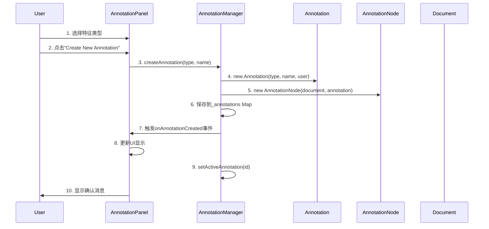
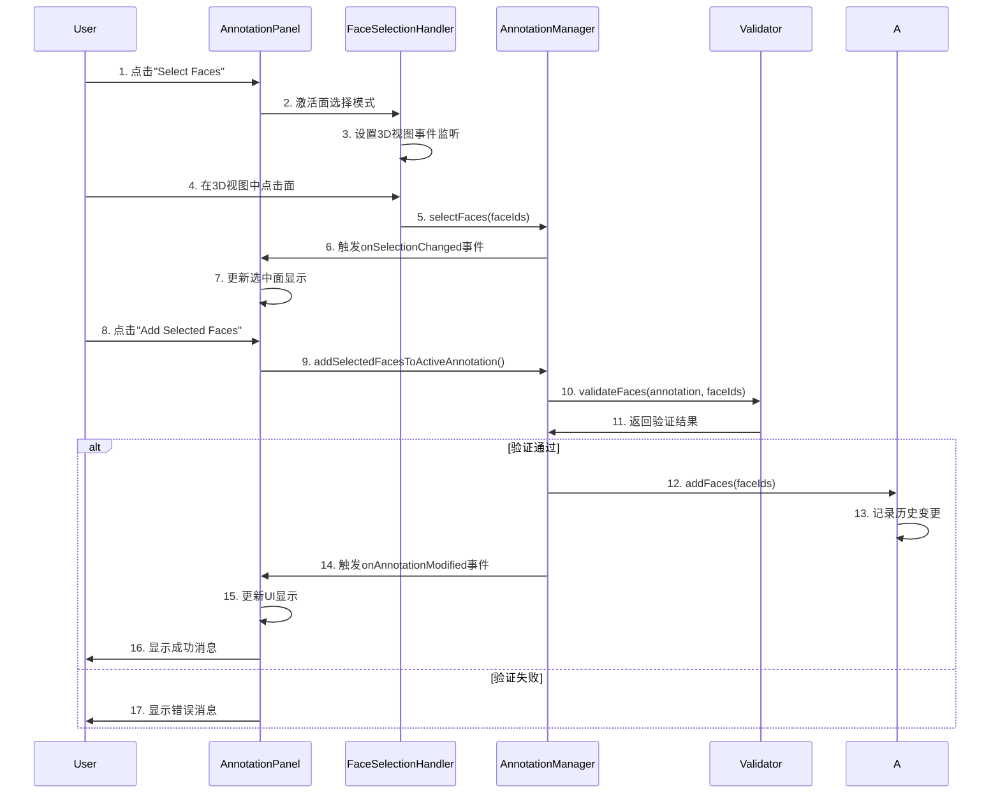

# BREP模型标注系统技术架构文档

## 系统概述

BREP模型标注系统（chili-annotation）是chili3d v0.6项目的核心扩展包，专门用于3D CAD模型的机加工特征标注。该系统支持22种标准机加工特征类型的识别、标注和验证，为学术研究（AAGNet格式）和工业应用（MFTRCAD格式）提供标准化数据导出。系统已完全集成到chili3d的命令体系、UI界面和国际化框架中。

### 核心功能

- **多特征类型支持**：支持基础特征、圆角特征、孔类特征、3D特征、底切特征等22种机加工特征
- **智能面选择**：直接点击多选，支持Ctrl+A全选、Ctrl+I反选等快捷键
- **实时验证**：三层验证系统（拓扑、几何、标注完整性验证）
- **多格式导出**：AAGNet和MFTRCAD标准格式导出
- **历史追踪**：完整的操作历史记录和撤销/重做支持
- **可视化反馈**：面高亮显示和交互式UI面板
- **命令系统集成**：完全集成到chili3d命令架构，支持Ribbon界面
- **国际化支持**：完整的中英文界面支持
- **面ID一致性**：与OCC原生索引对齐的面ID系统

## 架构设计

### 整体架构图

```
┌─────────────────────────────────────────────────────────┐
│                 chili-annotation 系统                    │
├─────────────────────────────────────────────────────────┤
│  UI层                                                   │
│  ┌─────────────────┐  ┌─────────────────────────────┐   │
│  │ AnnotationPanel │  │ FaceSelectionHandler        │   │
│  │ (标注面板)       │  │ (面选择处理器)                │   │
│  └─────────────────┘  └─────────────────────────────┘   │
├─────────────────────────────────────────────────────────┤
│  管理层                                                 │
│  ┌─────────────────────────────────────────────────────┐ │
│  │            AnnotationManager                        │ │
│  │            (标注管理器)                             │ │
│  └─────────────────────────────────────────────────────┘ │
├─────────────────────────────────────────────────────────┤
│  模型层                                                 │
│  ┌────────────┐  ┌────────────┐  ┌──────────────────┐  │
│  │Annotation  │  │AnnotationN │  │MachiningFeatureT │  │
│  │(标注实体)   │  │ode(节点)    │  │ype(特征类型)       │  │
│  └────────────┘  └────────────┘  └──────────────────┘  │
├─────────────────────────────────────────────────────────┤
│  验证层                                                 │
│  ┌──────────────┐ ┌────────────────┐ ┌──────────────┐  │
│  │TopologyValid │ │GeometryValidat │ │AnnotationVal │  │
│  │ator(拓扑验证) │ │or(几何验证)     │ │idator(标注验证)│  │
│  └──────────────┘ └────────────────┘ └──────────────┘  │
├─────────────────────────────────────────────────────────┤
│  导出层                                                 │
│  ┌─────────────────┐     ┌─────────────────────────┐    │
│  │ AAGNetExporter  │     │ MFTRCADExporter         │    │
│  │ (学术格式导出器) │     │ (工业格式导出器)         │    │
│  └─────────────────┘     └─────────────────────────┘    │
├─────────────────────────────────────────────────────────┤
│  命令层                                                 │
│  ┌─────────────────────────────────────────────────────┐ │
│  │          Command System Integration                 │ │
│  │     (与chili3d命令系统集成的各种标注命令)              │ │
│  └─────────────────────────────────────────────────────┘ │
└─────────────────────────────────────────────────────────┘
           │                    │                    │
           ▼                    ▼                    ▼
    ┌─────────────┐     ┌─────────────┐     ┌─────────────┐
    │ chili-core  │     │ chili-three │     │ chili-ui    │
    │(核心系统)    │     │(3D渲染)      │     │(UI组件)      │
    └─────────────┘     └─────────────┘     └─────────────┘
```

## 核心组件详解

### 1. 标注实体 (Annotation Class)

**文件**: `src/annotation.ts`

标注系统的核心数据模型，封装了机加工特征的所有信息。

```typescript
export class Annotation implements IDisposable {
    readonly id: string;                    // 唯一标识符
    private _type: MachiningFeatureType;    // 特征类型
    private _name: string;                  // 特征名称
    private _faces: Set<number>;            // 关联的面ID集合
    private _geometricParams: GeometricParams;    // 几何参数
    private _toleranceSpec: ToleranceSpec;        // 公差规范
    private _metadata: AnnotationMetadata;        // 标注元数据
    private _history: AnnotationRecord[];         // 操作历史
}
```

**关键特性**：
- 使用Set存储面ID，确保唯一性
- 完整的历史记录追踪
- 支持几何参数和公差规范
- 实现IDisposable接口，支持资源清理

### 2. 标注节点 (AnnotationNode Class)

**文件**: `src/annotationNode.ts`

扩展chili3d的Node系统，将标注实体集成到3D场景图中。

```typescript
export class AnnotationNode extends Node {
    private _annotation: Annotation;
    
    // chili3d属性装饰器集成
    @Serializer.serialze()
    @Property.define("annotation.featureType" as any)
    get featureType(): MachiningFeatureType { ... }
}
```

**集成要点**：
- 继承chili3d的Node类
- 使用@Property装饰器集成属性系统
- 支持序列化和克隆
- 响应可视化状态变更

### 3. 标注管理器 (AnnotationManager Class)

**文件**: `src/annotationManager.ts`

系统的核心管理器，负责标注的生命周期管理和状态协调。

```typescript
export class AnnotationManager implements IDisposable {
    private _document: IDocument;                    // 关联文档
    private _annotations = new Map<string, AnnotationNode>(); // 标注存储
    private _history = new AnnotationHistory();     // 历史管理
    private _validator: IAnnotationValidator;       // 验证器
    private _selectedFaces = new Set<number>();     // 选中面
    private _activeAnnotation: AnnotationNode | undefined; // 活动标注
}
```

**核心功能**：
- 标注的创建、删除、修改
- 面选择状态管理
- 历史操作的撤销/重做
- 事件系统（创建、修改、删除事件）
- 验证协调

### 4. 面选择处理器 (FaceSelectionHandler Class)

**文件**: `src/ui/faceSelectionHandler.ts`

处理3D视图中的面选择交互，支持多种选择模式。

```typescript
export class FaceSelectionHandler {
    private _selectionMode = FaceSelectionMode.Single;
    private _highlightedFaces = new Set<number>();
    
    // 选择模式
    export enum FaceSelectionMode {
        Single = "single",      // 单选
        Multiple = "multiple",  // 多选
        Range = "range"         // 范围选择
    }
}
```

**交互特性**：
- 支持单选、多选、范围选择
- 键盘快捷键支持（Ctrl+A全选，Ctrl+I反选，Esc清除）
- 实时视觉反馈
- 面悬停效果

### 5. 标注面板 (AnnotationPanel Class)

**文件**: `src/ui/annotationPanel.ts`

主要的用户界面，提供完整的标注操作界面。

**UI组件结构**：
```
┌─────────────────────────────────┐
│ BREP Model Annotation           │
│ Machining Feature Annotation    │
├─────────────────────────────────┤
│ Feature Type: [下拉选择器]       │
├─────────────────────────────────┤
│ Active Annotation:              │
│ ┌─────────────────────────────┐ │
│ │ 标注信息显示区域              │ │
│ └─────────────────────────────┘ │
│ ┌─────────────────────────────┐ │
│ │ 选中面信息显示区域            │ │
│ └─────────────────────────────┘ │
├─────────────────────────────────┤
│ [Create New Annotation]         │
│ [Select Faces]                  │
│ [Add Selected Faces]            │
│ [Confirm Annotation]            │
│ [Delete Active]                 │
├─────────────────────────────────┤
│ Annotations:                    │
│ ┌─────────────────────────────┐ │
│ │ 标注列表滚动区域              │ │
│ └─────────────────────────────┘ │
├─────────────────────────────────┤
│ [Export AAGNet] [Export MFTRCAD]│
└─────────────────────────────────┘
```

## 数据流和交互模式

### 标注创建流程

支持点击标注列表项高亮对应面功能，提供完整的视觉反馈。



### 面选择与添加流程



## 特征类型系统

### 支持的特征类型（22种）

**文件**: `src/featureTypes.ts`

```typescript
export enum MachiningFeatureType {
    // Basic Features 基础特征 (0-4)
    Faces = 0,                      // 面
    ClosedPockets = 1,              // 封闭型腔
    OpenPockets = 2,                // 开放型腔
    ThroughPockets = 3,             // 通型腔
    Walls = 4,                      // 壁

    // Filleted Features 圆角特征 (5-8)
    FilletedClosedPockets = 5,      // 圆角封闭型腔
    FilletedOpenPockets = 6,        // 圆角开放型腔
    FilletedWalls = 7,              // 圆角壁
    FilletedBosses = 8,             // 圆角凸台

    // Holes 孔特征 (9-13)
    ThroughHoles = 9,               // 通孔
    BlindHoles = 10,                // 盲孔
    ThreadedHoles = 11,             // 螺纹孔
    Countersinks = 12,              // 沉头孔
    SteppedHoles = 13,              // 阶梯孔 (大于2个同轴圆柱面组合)

    // 3D Features 3D特征 (14)
    ContourSurfaces = 14,           // 轮廓曲面

    // Undercuts 底切 (15-16)
    TSlots = 15,                    // T型槽
    Dovetails = 16,                 // 燕尾槽

    // Other 其他 (17-21)
    Chamfers = 17,                  // 倒角
    SlantedFaces = 18,              // 斜面
    InnerFillets = 19,              // 内圆角
    OuterFillets = 20,              // 外圆角
    ComplexPockets = 21,            // 复合型腔
}
```


### 特征分类体系和UI显示

系统采用6级分类体系，在UI界面中以分组形式展示：

- **基础特征 (Basic Features)**: 
  - Faces (面), ClosedPockets (封闭型腔), OpenPockets (开放型腔), ThroughPockets (通型腔), Walls (壁)

- **圆角特征 (Filleted Features)**: 
  - FilletedClosedPockets (圆角封闭型腔), FilletedOpenPockets (圆角开放型腔), FilletedWalls (圆角壁), FilletedBosses (圆角凸台)

- **孔类特征 (Holes)**: 
  - ThroughHoles (通孔), BlindHoles (盲孔), ThreadedHoles (螺纹孔), Countersinks (沉头孔), SteppedHoles (阶梯孔)

- **3D特征 (3D Features)**: 
  - ContourSurfaces (轮廓曲面)

- **底切特征 (Undercuts)**: 
  - TSlots (T型槽), Dovetails (燕尾槽)

- **其他特征 (Other)**: 
  - Chamfers (倒角), SlantedFaces (斜面), InnerFillets (内圆角), OuterFillets (外圆角), ComplexPockets (复合型腔)

#### UI界面特征选择器
在`annotationPanel.ts`中，特征类型以分组下拉菜单形式展示，每个选项同时显示英文和中文名称：

```html
<optgroup label="Holes (孔)">
    <option value="9">  Through Holes (通孔)</option>
    <option value="10">  Blind Holes (盲孔)</option>
    <option value="11">  Threaded Holes (螺纹孔)</option>
    <option value="12">  Countersinks (沉头孔)</option>
    <option value="13">  Stepped Holes (阶梯孔)</option>
</optgroup>
```

## 验证系统

### 三层验证架构

#### 1. 拓扑验证器 (TopologyValidator)
**文件**: `src/validators/topologyValidator.ts`
- 面连接性验证
- 面唯一性检查
- 几何一致性验证

#### 2. 几何验证器 (GeometryValidator)  
**文件**: `src/validators/geometryValidator.ts`
- 几何参数合理性验证
- 尺寸约束检查
- 公差规范验证

#### 3. 标注验证器 (AnnotationValidator)
**文件**: `src/validators/annotationValidator.ts`
- 基本属性验证（ID、名称、时间戳）
- 面数据验证（重复面检查、有效性）
- 特征类型约束验证

### 验证规则示例

```typescript
// 孔类特征验证规则
case MachiningFeatureType.ThroughHoles:
case MachiningFeatureType.BlindHoles:
case MachiningFeatureType.ThreadedHoles:
case MachiningFeatureType.Countersinks:
case MachiningFeatureType.SteppedHoles:
    if (faceCount < 1) {
        result.errors.push("Hole features must have at least 1 face");
    } else if (faceCount > 3) {
        result.warnings.push("Hole features typically have 1-3 faces");
    }
    break;

// 型腔特征验证规则
case MachiningFeatureType.ClosedPockets:
case MachiningFeatureType.OpenPockets:
case MachiningFeatureType.ThroughPockets:
case MachiningFeatureType.ComplexPockets:
    if (faceCount < 2) {
        result.errors.push("Pocket features must have at least 2 faces");
    }
    break;

// 圆角特征验证规则
case MachiningFeatureType.FilletedClosedPockets:
case MachiningFeatureType.FilletedOpenPockets:
case MachiningFeatureType.InnerFillets:
case MachiningFeatureType.OuterFillets:
    if (faceCount < 1) {
        result.errors.push("Fillet features must have at least 1 face");
    }
    break;
```

## 导出系统

### 导出器基类

**文件**: `src/exporters/baseExporter.ts`

```typescript
export abstract class BaseAnnotationExporter {
    abstract export(annotations: AnnotationNode[], 
                   modelFileName: string, 
                   totalFaceCount: number): any;
    
    protected buildSemanticLabels(annotations: AnnotationNode[]): Record<string, number>
    protected buildBottomLabels(annotations: AnnotationNode[], totalFaceCount: number): Record<string, number>
}
```

### AAGNet格式导出器

**文件**: `src/exporters/aagnetExporter.ts`

导出格式符合AAGNet/MFInstSeg学术研究标准：

```typescript
// 导出数据结构
{
    "seg": { "0": 1, "1": 2, ... },              // 语义分割标签
    "inst": [[1,0,1], [0,1,0], [1,0,1]],        // 实例分割邻接矩阵
    "bottom": { "0": 0, "1": 1, ... }           // 底面标签
}
```

● AAGNet导出器分析结果：

  通过分析代码，我发现AAGNet导出器没有相同的问题，但有一个相关的处理逻辑需要关注：

  AAGNet导出器的面ID处理：

  1. seg字段:
    使用基类的buildSemanticLabels()方法，直接将annotation.faces中的面ID作为键使用（第137行）
  2. inst字段: 使用buildInstanceMatrix()方法构建邻接矩阵，直接使用annotation.faces中的面ID作为矩阵
    索引（第135-142行）
  3. bottom字段: 使用基类的buildBottomLabels()方法

  关键发现：

  在ExportService.convertFaceIdsToOccNative()方法中，有专门针对AAGNet格式的处理逻辑（第490-497行）
  ：

  // 检查是否是邻接矩阵（方阵）
  const isMatrix = value.length > 0 && Array.isArray(value[0]) && value[0].length ===
  value.length;
  if (isMatrix) {
      // AAGNet格式的邻接矩阵不需要修改索引，因为矩阵索引本身就是0基的
      // 矩阵表示的是面与面之间的关系，索引仍然保持0基
      converted[key] = value;
  }

  AAGNet格式的特殊性：

  1. seg字段: 会被转换为1基索引（与MFTRCAD的cls字段一样）
  2. inst字段: 不会被转换，保持0基索引，因为：

    - 邻接矩阵的索引表示面ID在数组中的位置
    - 即使面ID转换为1基，矩阵索引仍然是0基的（matrix[0][0]表示第一个面）
    - 矩阵表示的是面与面之间的拓扑关系，不是面ID本身
  3. bottom字段: 会被转换为1基索引

● 结论：

  AAGNet导出器没有类似的面ID不一致问题，因为：

  1. 设计合理:
    AAGNet格式的inst字段使用邻接矩阵，这种设计本身就是基于0基索引的数据结构，不需要转换面ID。
  2. 转换逻辑正确: ExportService中已经有针对AAGNet格式的特殊处理，正确区分了：

    - 需要转换的字段: seg, bottom (对象类型的标签)
    - 不需要转换的字段: inst (邻接矩阵)
  3. 格式一致性:

    - seg和bottom字段的面ID会转换为OCC原生ID
    - inst字段保持矩阵索引的0基特性，这是正确的

  而MFTRCAD格式之前的问题是：seg字段使用的是面ID列表（不是矩阵索引），应该与cls字段使用相同的ID转
  换，但之前被遗漏了。

### MFTRCAD格式导出器和特征类型匹配

**文件**: `src/exporters/mftrcadExporter.ts`

MFTRCAD导出器采用了与AAGNet相似的格式，但使用不同的字段名称：

#### 导出数据结构
```typescript
// MFTRCAD导出格式
{
    "cls": { "0": 1, "1": 2, ... },          // 语义分割标签
    "seg": [[1,2,3], [4,5], []],            // 实例列表（每个数组为一个实例的面ID）
    "bottom": { "0": 0, "1": 1, ... }       // 底面标签
}
```

实际MFTRCAD导出数据分析

  语义分割标签 (cls)

  "cls": {
    "13": 12,    // 面ID 13 → 特征类型 12 (Countersinks - 沉头孔)
    "14": 12,    // 面ID 14 → 特征类型 12 (Countersinks - 沉头孔)
    "28": 12,    // 面ID 28 → 特征类型 12 (Countersinks - 沉头孔)
    "37": 9,     // 面ID 37 → 特征类型 9  (ThroughHoles - 通孔)
    "40": 12,    // 面ID 40 → 特征类型 12 (Countersinks - 沉头孔)
    "41": 12,    // 面ID 41 → 特征类型 12 (Countersinks - 沉头孔)
    "42": 12,    // 面ID 42 → 特征类型 12 (Countersinks - 沉头孔)
    "43": 9,     // 面ID 43 → 特征类型 9  (ThroughHoles - 通孔)
    "44": 9,     // 面ID 44 → 特征类型 9  (ThroughHoles - 通孔)
    "54": 12,    // 面ID 54 → 特征类型 12 (Countersinks - 沉头孔)
    "55": 12,    // 面ID 55 → 特征类型 12 (Countersinks - 沉头孔)
    "57": 12     // 面ID 57 → 特征类型 12 (Countersinks - 沉头孔)
  }

  实例分割列表 (seg)

  "seg": [
    [42],           // 实例0: 包含面42 (沉头孔特征)
    [43],           // 实例1: 包含面43 (通孔特征)
    [36],           // 实例2: 包含面36 (但cls中未定义，可能是未标注面)
    [12, 53, 41],   // 实例3: 多面特征 (面12,53,41组成的沉头孔)
    [13, 54, 40],   // 实例4: 多面特征 (面13,54,40组成的沉头孔)
    [27, 56, 39],   // 实例5: 多面特征 (面27,56,39，但cls中未完全定义)
    [],             // 实例6-9: 空实例占位符
    [],
    [],
    []
  ]

  特征类型映射验证

  根据这个实际数据，验证了文档中记录的特征类型映射关系：

  - ThroughHoles (9) → 实际使用：面37, 43, 44
  - Countersinks (12) → 实际使用：面13, 14, 28, 40, 41, 42, 54, 55, 57

  数据结构特点

  1. 稀疏映射：cls 字段只包含实际标注的面，未标注面不出现
  2. 实例分组：seg 数组将相关的面ID分组为实例
  3. 占位符：seg 数组末尾填充空数组作为占位符
  4. 多面特征：如实例3、4、5包含多个面ID，体现了复杂特征的面组合关系

  这个实际数据完美验证了文档中描述的MFTRCAD导出格式和特征类型映射机制的正确性。


#### 特征类型匹配

每种`MachiningFeatureType`枚举值直接对应MFTRCAD中的`cls`字段数值：

- **Faces (0)** → MFTRCAD cls: 0
- **ClosedPockets (1)** → MFTRCAD cls: 1
- **ThroughHoles (9)** → MFTRCAD cls: 9
- **BlindHoles (10)** → MFTRCAD cls: 10
- **Chamfers (17)** → MFTRCAD cls: 17
- **ComplexPockets (21)** → MFTRCAD cls: 21

#### 实例分割处理
```typescript
// 构建实例分割列表
private buildInstanceSegmentation(annotations: AnnotationNode[]): number[][] {
    const instances: number[][] = [];
    
    // 为每个标注创建一个实例
    for (const annotation of annotations) {
        if (annotation.faces.length > 0) {
            instances.push([...annotation.faces]);  // 该标注的所有面ID
        }
    }
    
    return instances;
}
```

#### 与AAGNet格式的转换
MFTRCAD导出器还提供了到AAGNet格式的转换功能：

```typescript
// 从MFTRCAD转换为AAGNet
static convertToAAGNet(mftrcadData: any, modelFileName: string, totalFaceCount: number): any {
    const seg = { ...mftrcadData.cls };  // 语义标签直接复制
    const inst = this.buildInstanceMatrixFromList(mftrcadData.seg, totalFaceCount);  // 列表转矩阵
    const bottom = { ...mftrcadData.bottom };  // 底面标签直接复制
    
    return [[modelFileName, { seg, inst, bottom }]];
}
```

## 与chili3d系统集成

### 命令系统集成

**文件**: `src/commands/annotationCommands.ts`

标注系统提供8个核心命令，都通过@command装饰器注册到chili3d命令系统：

```typescript
@command({
    key: "annotation.start",
    icon: "icon-play",
})
export class StartAnnotationCommandRegistered implements ICommand {
    async execute(application: IApplication): Promise<void> {
        // 集成到chili3d命令系统
    }
}
```

#### 可用命令列表
- `annotation.start` - 启动标注模式
- `annotation.stop` - 停止标注模式  
- `annotation.create` - 创建标注
- `annotation.delete` - 删除标注
- `annotation.validate` - 验证所有标注
- `annotation.clear` - 清除所有标注
- `annotation.export.aagnet` - 导出AAGNet格式
- `annotation.export.mftrcad` - 导出MFTRCAD格式

### Ribbon界面集成

**文件**: `packages/chili-builder/src/ribbon.ts`

完整的标注标签页已集成到chili3d的Ribbon界面中：

```typescript
{
    tabName: "ribbon.tab.annotation",
    groups: [
        {
            groupName: "ribbon.group.annotation.main",
            items: ["annotation.start", "annotation.stop", "annotation.create", "annotation.delete"]
        },
        {
            groupName: "ribbon.group.annotation.validate", 
            items: ["annotation.validate", "annotation.clear"]
        },
        {
            groupName: "ribbon.group.annotation.export",
            items: ["annotation.export.aagnet", "annotation.export.mftrcad"]
        }
    ]
}
```

### 国际化系统集成

**文件**: `packages/chili-core/src/i18n/`

支持完整的中英文界面，所有标注相关的UI文本都已集成到chili3d的i18n系统：

- **中文翻译** (`zh-cn.ts`): "标注"、"启动标注"、"创建标注"等
- **英文翻译** (`en.ts`): "Annotation"、"Start Annotation"、"Create Annotation"等
- **类型系统集成**: 所有翻译键已注册到TypeScript类型系统

### 文档系统集成

- 标注管理器与IDocument关联
- 标注节点扩展chili3d的Node系统
- 支持文档的序列化和反序列化
- 集成到chili3d的事务和历史系统

### 可视化系统集成

- 使用chili3d的VisualState进行面高亮
- 集成三维场景的拾取系统
- 响应视图变化和更新
- 支持点击标注列表项高亮对应面
- 面ID索引与OCC原生索引对齐

## 事件系统

### 管理器级事件

```typescript
// 标注管理器事件
onAnnotationCreated(callback: (node: AnnotationNode) => void): void
onAnnotationDeleted(callback: (node: AnnotationNode) => void): void  
onAnnotationModified(callback: (node: AnnotationNode) => void): void
onSelectionChanged(callback: (faceIds: number[]) => void): void
```

### 面选择处理器事件

```typescript
// 面选择事件
onFaceSelected(callback: (faceId: number) => void): void
onFaceDeselected(callback: (faceId: number) => void): void
onSelectionChanged(callback: (selectedFaces: number[]) => void): void
```

## API参考

### 主要接口和类

#### AnnotationSystemConfig

```typescript
export interface AnnotationSystemConfig {
    enableValidation?: boolean;        // 启用验证功能
    enableHistory?: boolean;           // 启用历史记录
    maxHistorySize?: number;          // 最大历史记录数
    defaultExportFormat?: "aagnet" | "mftrcad";  // 默认导出格式
    autoSaveInterval?: number;        // 自动保存间隔
}
```

#### GeometricParams

```typescript
export interface GeometricParams {
    diameter?: number;      // 直径
    depth?: number;         // 深度  
    width?: number;         // 宽度
    height?: number;        // 高度
    length?: number;        // 长度
    axis?: [number, number, number];     // 轴向
    center?: [number, number, number];   // 中心点
    angle?: number;         // 角度
    radius?: number;        // 半径
}
```

#### ToleranceSpec

```typescript
export interface ToleranceSpec {
    tolerance?: string;         // 公差等级，如"H7", "IT6"
    surfaceFinish?: string;     // 表面粗糙度，如"Ra1.6" 
    geometricTolerance?: string; // 几何公差
    notes?: string;             // 备注
}
```

### 使用示例

#### 基本标注操作
```typescript
// 创建标注管理器
const manager = new AnnotationManager(document);

// 创建标注
const annotation = manager.createAnnotation(
    MachiningFeatureType.ThroughHoles, 
    "Hole_001"
);

// 添加面到标注
manager.selectFaces([1, 2, 3]);
manager.addSelectedFacesToActiveAnnotation();

// 验证标注
const result = manager.validateAll();
if (result.isValid) {
    // 导出标注
    const exporter = new AAGNetExporter();
    const exportData = exporter.export(
        manager.annotations, 
        "model.step", 
        100
    );
}
```

#### 命令系统使用
```typescript
// 通过命令系统执行标注操作
const application = getCurrentApplication();
await application.executeCommand("annotation.start");
await application.executeCommand("annotation.create");

// 导出操作
await application.executeCommand("annotation.export.aagnet");
```

#### 面选择和高亮
```typescript
// 设置面选择处理器
const handler = new FaceSelectionHandler();
handler.setSelectionMode(FaceSelectionMode.Multiple);

// 监听面选择事件
handler.onSelectionChanged((faceIds) => {
    console.log('选中的面:', faceIds);
});

// 高亮指定面
manager.highlightFaces([1, 2, 3], true);
```

## 性能考虑

### 内存管理
- 使用WeakMap存储视觉对象映射
- 及时释放不再使用的标注和历史记录
- 实现IDisposable接口确保资源清理
- 优化面ID存储和查找机制

### 渲染优化
- 批量更新面高亮状态
- 使用节流机制处理鼠标事件
- 延迟加载大型模型的面信息
- 面高亮的增量更新机制
- 标注列表项点击的高效面定位

### 数据结构优化
- 使用Set存储面ID，保证O(1)查找
- Map结构快速访问标注实例
- 历史记录限制大小避免内存泄漏
- 面ID转换的缓存机制
- 优化的邻接矩阵计算

### 导出性能
- 支持大型模型的增量导出
- AAGNet和MFTRCAD格式的高效序列化
- 面数据的批量处理和验证

## 扩展点

### 自定义特征类型
可以扩展MachiningFeatureType枚举添加新的特征类型，系统已支持22种标准特征。

### 自定义验证器
实现IAnnotationValidator接口创建特定领域的验证规则，支持三层验证架构。

### 自定义导出器
继承BaseAnnotationExporter创建新的导出格式支持，当前支持AAGNet和MFTRCAD格式。

### UI定制
AnnotationPanel支持通过CSS和配置进行界面定制，完全集成chili3d的UI框架。

### 国际化扩展
可以轻松添加新的语言支持，只需在i18n系统中添加相应翻译文件。

### 命令系统扩展
可以基于现有的命令架构添加新的标注相关命令，自动集成到Ribbon界面。

---

*本文档版本: v0.6.0*  
*最后更新: 2025年9月*  
*项目版本: Chili3D v0.6.0*  
*作者: chili-annotation开发团队*