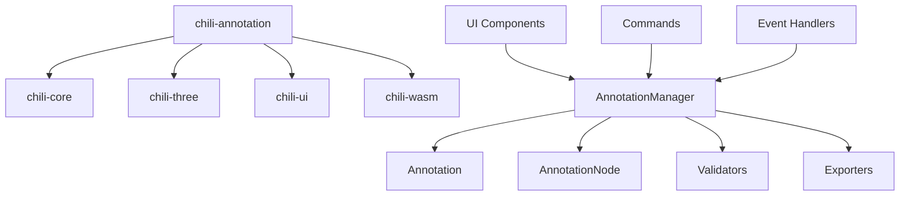

# BREP标注系统集成指南

本指南面向开发者，详细介绍如何将BREP模型数据标注系统集成到chili3d项目或其他3D CAD应用中。

## 目录
1. [架构概述](#架构概述)
2. [快速集成](#快速集成)
3. [模块集成](#模块集成)
4. [自定义扩展](#自定义扩展)
5. [API参考](#api参考)
6. [部署指南](#部署指南)

---

## 架构概述

### 系统架构图
```
┌─────────────────────────────────────────────────────────┐
│                    应用层 (Application Layer)             │
├─────────────────────────────────────────────────────────┤
│  UI Components     │  Commands        │  Event Handlers  │
│  ├─ AnnotationPanel│  ├─ StartCommand │  ├─ FaceSelection│
│  ├─ SelectionHandler│  ├─ CreateCommand│  ├─ KeyboardEvent│
│  └─ PropertyEditor │  └─ ExportCommand│  └─ MouseEvent   │
├─────────────────────────────────────────────────────────┤
│                   业务层 (Business Layer)                 │
├─────────────────────────────────────────────────────────┤
│  AnnotationManager │  Validators      │  Exporters       │
│  ├─ CRUD Operations│  ├─ Annotation   │  ├─ AAGNet      │
│  ├─ History Mgmt   │  ├─ Topology     │  ├─ MFTRCAD     │
│  └─ Event System   │  └─ Geometry     │  └─ Custom      │
├─────────────────────────────────────────────────────────┤
│                   数据层 (Data Layer)                     │
├─────────────────────────────────────────────────────────┤
│  Annotation Models │  Feature Types   │  Serialization   │
│  ├─ Annotation     │  ├─ 27 Types     │  ├─ JSON        │
│  ├─ AnnotationNode │  ├─ Constraints  │  ├─ XML         │
│  └─ Metadata       │  └─ Validation   │  └─ Binary      │
├─────────────────────────────────────────────────────────┤
│                   平台层 (Platform Layer)                 │
├─────────────────────────────────────────────────────────┤
│       chili-core         │       chili-three             │
│  ├─ Document System      │  ├─ 3D Rendering              │
│  ├─ Command Framework    │  ├─ Visual Selection          │
│  ├─ Node Architecture    │  └─ Scene Management          │
│  └─ Event System         │                               │
└─────────────────────────────────────────────────────────┘
```

### 核心模块依赖关系


---

## 快速集成

### 1. 安装依赖

```bash
# 在chili3d项目根目录下
cd packages/chili-annotation
npm install

# 或者在项目中添加依赖
npm install --save chili-annotation
```

### 2. 基础集成代码

```typescript
// main.ts
import { 
    AnnotationManager, 
    AnnotationPanel, 
    FaceSelectionHandler,
    registerAnnotationCommands
} from 'chili-annotation';
import { IDocument, IApplication } from 'chili-core';

class AnnotationIntegration {
    private manager: AnnotationManager;
    private panel: AnnotationPanel;
    private selectionHandler: FaceSelectionHandler;

    constructor(private document: IDocument, private app: IApplication) {
        this.initialize();
    }

    private initialize(): void {
        // 1. 创建标注管理器
        this.manager = new AnnotationManager(this.document);

        // 2. 创建UI面板
        this.panel = new AnnotationPanel(this.manager, this.document);
        
        // 3. 创建面选择处理器
        const display = this.document.visual.displays[0];
        this.selectionHandler = new FaceSelectionHandler(
            this.manager, 
            this.document, 
            display
        );

        // 4. 集成到应用界面
        this.integrateUI();

        // 5. 注册命令
        registerAnnotationCommands(this.app.commandRegistry);

        // 6. 设置事件监听
        this.setupEventListeners();
    }

    private integrateUI(): void {
        // 添加标注面板到右侧面板
        const rightPanel = this.app.workspace.rightPanel;
        if (rightPanel) {
            rightPanel.appendChild(this.panel.element);
        }

        // 添加工具栏按钮
        this.addToolbarButtons();
    }

    private addToolbarButtons(): void {
        const toolbar = this.app.workspace.toolbar;
        
        // 启动标注按钮
        toolbar.addButton({
            id: 'start-annotation',
            text: 'Start Annotation',
            icon: 'annotation-icon',
            command: 'annotation.start'
        });

        // 导出按钮
        toolbar.addButton({
            id: 'export-annotation',
            text: 'Export',
            icon: 'export-icon',
            command: 'annotation.export'
        });
    }

    private setupEventListeners(): void {
        // 监听文档变化
        this.document.onSelectionChanged.add(() => {
            // 处理选择变化
        });

        // 监听标注变化
        this.manager.onAnnotationAdded.add((annotation) => {
            console.log(`Annotation added: ${annotation.name}`);
        });
    }
}

// 使用示例
export function initializeAnnotationSystem(
    document: IDocument, 
    app: IApplication
): AnnotationIntegration {
    return new AnnotationIntegration(document, app);
}
```

### 3. HTML集成

```html
<!-- index.html -->
<!DOCTYPE html>
<html>
<head>
    <title>Chili3D with Annotation</title>
    <link rel="stylesheet" href="annotation-styles.css">
</head>
<body>
    <div id="app">
        <div id="toolbar">
            <!-- 工具栏 -->
        </div>
        <div id="main-content">
            <div id="left-panel">
                <!-- 文档树 -->
            </div>
            <div id="viewport">
                <!-- 3D视图 -->
            </div>
            <div id="right-panel">
                <!-- 标注面板将被插入到这里 -->
            </div>
        </div>
    </div>
    <script src="app.bundle.js"></script>
</body>
</html>
```

### 4. CSS样式

```css
/* annotation-styles.css */
.annotation-panel {
    width: 300px;
    background: #f5f5f5;
    border-left: 1px solid #ddd;
    padding: 16px;
    box-sizing: border-box;
}

.annotation-panel .feature-selector {
    width: 100%;
    margin-bottom: 16px;
    padding: 8px;
    border: 1px solid #ccc;
    border-radius: 4px;
}

.annotation-list-item {
    padding: 8px;
    margin-bottom: 4px;
    background: white;
    border: 1px solid #eee;
    border-radius: 4px;
    cursor: pointer;
    transition: all 0.2s;
}

.annotation-list-item:hover {
    background: #e8f4fd;
}

.annotation-list-item.active {
    background: #e3f2fd;
    border-color: #2196f3;
}

.face-highlight {
    stroke: #00ff00;
    stroke-width: 2px;
    fill-opacity: 0.3;
}
```

---

## 模块集成

### 标注管理器集成

```typescript
// custom-annotation-manager.ts
import { AnnotationManager, Annotation } from 'chili-annotation';
import { IDocument } from 'chili-core';

export class CustomAnnotationManager extends AnnotationManager {
    constructor(document: IDocument) {
        super(document);
        this.setupCustomValidation();
        this.setupCustomExport();
    }

    // 自定义验证规则
    private setupCustomValidation(): void {
        this.addValidator('custom-rule', (annotation: Annotation) => {
            // 实现自定义验证逻辑
            const result = { isValid: true, errors: [], warnings: [] };
            
            // 示例：检查特定命名规范
            if (!annotation.name.match(/^[A-Z]+_\d+$/)) {
                result.errors.push('Annotation name must follow pattern: TYPE_NUMBER');
                result.isValid = false;
            }
            
            return result;
        });
    }

    // 自定义导出格式
    private setupCustomExport(): void {
        this.addExporter('custom-format', (annotations, fileName, totalFaceCount) => {
            // 实现自定义导出逻辑
            return {
                metadata: {
                    fileName,
                    totalFaces: totalFaceCount,
                    annotationCount: annotations.length,
                    exportTime: new Date().toISOString()
                },
                features: annotations.map(ann => ({
                    id: ann.id,
                    type: ann.type,
                    faces: ann.faces,
                    parameters: ann.geometricParameters
                }))
            };
        });
    }
}
```

### 自定义UI面板

```typescript
// custom-annotation-panel.ts
import { AnnotationPanel } from 'chili-annotation';
import { div, button } from 'chili-ui';

export class CustomAnnotationPanel extends AnnotationPanel {
    private customSection: HTMLElement;

    protected createPanelElement(): HTMLDivElement {
        const panel = super.createPanelElement();
        
        // 添加自定义功能区
        this.customSection = this.createCustomSection();
        panel.appendChild(this.customSection);
        
        return panel;
    }

    private createCustomSection(): HTMLElement {
        return div({
            children: [
                button({
                    textContent: 'Batch Auto-Annotate',
                    onclick: () => this.batchAutoAnnotate()
                }),
                button({
                    textContent: 'Quality Check',
                    onclick: () => this.runQualityCheck()
                }),
                button({
                    textContent: 'Export Report',
                    onclick: () => this.exportReport()
                })
            ],
            style: {
                marginTop: '16px',
                padding: '12px',
                background: '#fff',
                border: '1px solid #ddd',
                borderRadius: '4px'
            }
        });
    }

    private batchAutoAnnotate(): void {
        // 实现批量自动标注逻辑
        console.log('Starting batch auto-annotation...');
    }

    private runQualityCheck(): void {
        // 实现质量检查逻辑
        console.log('Running quality check...');
    }

    private exportReport(): void {
        // 实现报告导出逻辑
        console.log('Exporting annotation report...');
    }
}
```

### 事件系统集成

```typescript
// event-integration.ts
import { AnnotationManager } from 'chili-annotation';

export class AnnotationEventManager {
    constructor(private manager: AnnotationManager) {
        this.setupEventHandlers();
    }

    private setupEventHandlers(): void {
        // 标注生命周期事件
        this.manager.onAnnotationAdded.add(this.onAnnotationAdded.bind(this));
        this.manager.onAnnotationRemoved.add(this.onAnnotationRemoved.bind(this));
        this.manager.onAnnotationUpdated.add(this.onAnnotationUpdated.bind(this));

        // 选择事件
        this.manager.onSelectedFacesChanged.add(this.onSelectedFacesChanged.bind(this));
        this.manager.onActiveAnnotationChanged.add(this.onActiveAnnotationChanged.bind(this));

        // 验证事件
        this.manager.onValidationCompleted.add(this.onValidationCompleted.bind(this));
    }

    private onAnnotationAdded(annotation: any): void {
        // 发送到分析服务
        this.sendToAnalytics('annotation_created', {
            type: annotation.type,
            faceCount: annotation.faces.length
        });

        // 更新统计信息
        this.updateStatistics();
    }

    private onAnnotationRemoved(annotationId: string): void {
        this.sendToAnalytics('annotation_deleted', { id: annotationId });
    }

    private onAnnotationUpdated(annotation: any): void {
        this.sendToAnalytics('annotation_modified', {
            id: annotation.id,
            type: annotation.type
        });
    }

    private onSelectedFacesChanged(faces: number[]): void {
        // 更新UI状态
        document.dispatchEvent(new CustomEvent('faces-selected', {
            detail: { faces }
        }));
    }

    private onActiveAnnotationChanged(annotation: any): void {
        // 更新UI焦点
        document.dispatchEvent(new CustomEvent('active-annotation-changed', {
            detail: { annotation }
        }));
    }

    private onValidationCompleted(result: any): void {
        if (!result.isValid) {
            // 显示验证错误
            this.showValidationErrors(result.errors);
        }
    }

    private sendToAnalytics(event: string, data: any): void {
        // 发送到分析服务
        if (window.analytics) {
            window.analytics.track(event, data);
        }
    }

    private updateStatistics(): void {
        // 更新统计面板
        const stats = this.manager.getStatistics();
        document.dispatchEvent(new CustomEvent('stats-updated', {
            detail: stats
        }));
    }

    private showValidationErrors(errors: string[]): void {
        // 显示错误提示
        const errorPanel = document.getElementById('error-panel');
        if (errorPanel) {
            errorPanel.innerHTML = errors.map(err => 
                `<div class="error-item">${err}</div>`
            ).join('');
            errorPanel.style.display = 'block';
        }
    }
}
```

---

## 自定义扩展

### 添加新的特征类型

```typescript
// custom-feature-types.ts
import { MachiningFeatureType, MachiningFeatureInfo } from 'chili-annotation';

// 扩展特征类型枚举
export enum CustomFeatureType {
    // 继承原有类型
    ...MachiningFeatureType,
    
    // 添加新类型
    ThreadedHole = 100,
    Groove = 101,
    KeyWay = 102,
    Taper = 103
}

// 扩展特征信息
export const CustomFeatureInfo = {
    ...MachiningFeatureInfo,
    
    [CustomFeatureType.ThreadedHole]: {
        nameEN: "Threaded Hole",
        nameCN: "螺纹孔",
        color: "#FF6B6B",
        category: "hole"
    },
    
    [CustomFeatureType.Groove]: {
        nameEN: "Groove", 
        nameCN: "沟槽",
        color: "#4ECDC4",
        category: "slot"
    },
    
    [CustomFeatureType.KeyWay]: {
        nameEN: "Key Way",
        nameCN: "键槽", 
        color: "#45B7D1",
        category: "slot"
    },
    
    [CustomFeatureType.Taper]: {
        nameEN: "Taper",
        nameCN: "锥面",
        color: "#96CEB4",
        category: "surface"
    }
};
```

### 自定义导出器

```typescript
// custom-exporter.ts
import { BaseAnnotationExporter, ExportConfig } from 'chili-annotation';

export class CustomFormatExporter extends BaseAnnotationExporter {
    constructor(config: ExportConfig = {}) {
        super({ ...config, format: 'custom' });
    }

    export(annotations: any[], modelFileName: string, totalFaceCount: number): any {
        // 自定义导出格式
        const customFormat = {
            // 元数据
            metadata: {
                format: "CustomFormat_v1.0",
                modelFile: modelFileName,
                totalFaces: totalFaceCount,
                annotationCount: annotations.length,
                exportDate: new Date().toISOString(),
                software: "Chili3D Annotation System"
            },
            
            // 特征列表
            features: annotations.map(annotation => ({
                // 基本信息
                uuid: annotation.id,
                name: annotation.name,
                type: this.getFeatureTypeName(annotation.type),
                confidence: annotation.metadata.confidence || 1.0,
                
                // 几何信息
                geometry: {
                    faces: annotation.faces,
                    parameters: annotation.geometricParameters,
                    tolerance: annotation.toleranceSpecs,
                    boundingBox: this.calculateBoundingBox(annotation)
                },
                
                // 拓扑信息
                topology: {
                    adjacentFeatures: this.findAdjacentFeatures(annotation, annotations),
                    connectivity: this.analyzeConnectivity(annotation)
                },
                
                // 制造信息
                manufacturing: {
                    machiningMethod: this.inferMachiningMethod(annotation.type),
                    toolType: this.inferToolType(annotation.type),
                    complexity: this.calculateComplexity(annotation)
                }
            })),
            
            // 全局关系图
            relationships: this.buildRelationshipGraph(annotations),
            
            // 质量报告
            quality: {
                validation: this.validateAllFeatures(annotations),
                statistics: this.calculateStatistics(annotations),
                warnings: this.collectWarnings(annotations)
            }
        };

        return customFormat;
    }

    validate(exportedData: any): { isValid: boolean; errors: string[] } {
        const errors: string[] = [];

        // 验证自定义格式
        if (!exportedData.metadata) {
            errors.push("Missing metadata section");
        }

        if (!exportedData.features || !Array.isArray(exportedData.features)) {
            errors.push("Invalid features section");
        }

        return { isValid: errors.length === 0, errors };
    }

    protected getFormatName(): string {
        return "Custom Manufacturing Format";
    }

    private calculateBoundingBox(annotation: any): any {
        // 计算包围盒
        return { min: [0,0,0], max: [0,0,0] };
    }

    private findAdjacentFeatures(annotation: any, allAnnotations: any[]): string[] {
        // 查找相邻特征
        return [];
    }

    private analyzeConnectivity(annotation: any): any {
        // 分析连通性
        return { type: "connected", neighbors: [] };
    }

    private inferMachiningMethod(featureType: number): string {
        // 推断加工方法
        const methods: Record<number, string> = {
            2: "drilling",      // ThroughHole
            3: "drilling",      // BlindHole
            4: "milling",       // RectangularPocket
            // ... 更多映射
        };
        return methods[featureType] || "unknown";
    }

    private inferToolType(featureType: number): string {
        // 推断刀具类型
        const tools: Record<number, string> = {
            2: "twist_drill",
            3: "twist_drill", 
            4: "end_mill",
            // ... 更多映射
        };
        return tools[featureType] || "unknown";
    }

    private calculateComplexity(annotation: any): number {
        // 计算特征复杂度
        let complexity = 1.0;
        complexity += annotation.faces.length * 0.1;
        complexity += Object.keys(annotation.geometricParameters).length * 0.05;
        return Math.min(complexity, 5.0);
    }

    private buildRelationshipGraph(annotations: any[]): any {
        // 构建关系图
        return { nodes: [], edges: [] };
    }

    private validateAllFeatures(annotations: any[]): any {
        // 验证所有特征
        return { passed: 0, failed: 0, warnings: 0 };
    }

    private calculateStatistics(annotations: any[]): any {
        // 计算统计信息
        return {
            totalFeatures: annotations.length,
            featureTypes: {},
            averageComplexity: 1.0
        };
    }

    private collectWarnings(annotations: any[]): string[] {
        // 收集警告
        return [];
    }
}
```

### 自定义验证器

```typescript
// custom-validator.ts
import { IAnnotationValidator, ValidationResult, Annotation } from 'chili-annotation';

export class ManufacturingValidator implements IAnnotationValidator {
    validateAnnotation(annotation: Annotation): ValidationResult {
        const result: ValidationResult = {
            isValid: true,
            errors: [],
            warnings: []
        };

        // 制造可行性验证
        this.validateManufacturability(annotation, result);
        
        // 工具可达性验证
        this.validateToolAccessibility(annotation, result);
        
        // 成本评估
        this.validateCostEfficiency(annotation, result);

        result.isValid = result.errors.length === 0;
        return result;
    }

    validateFaces(annotation: Annotation, faceIds: number[]): ValidationResult {
        // 面的制造相关验证
        return { isValid: true, errors: [], warnings: [] };
    }

    validateFeatureType(annotation: Annotation): ValidationResult {
        // 特征类型的制造验证
        return { isValid: true, errors: [], warnings: [] };
    }

    validateCompleteness(annotation: Annotation): ValidationResult {
        // 制造完整性验证
        return { isValid: true, errors: [], warnings: [] };
    }

    private validateManufacturability(annotation: Annotation, result: ValidationResult): void {
        const params = annotation.geometricParameters;
        
        // 检查深径比（深度vs直径比例）
        if (params.depth && params.diameter) {
            const aspectRatio = params.depth / params.diameter;
            if (aspectRatio > 10) {
                result.warnings.push(
                    `High depth-to-diameter ratio (${aspectRatio.toFixed(1)}:1) may cause manufacturing difficulties`
                );
            }
        }

        // 检查最小壁厚
        if (params.wallThickness && params.wallThickness < 1.0) {
            result.errors.push(
                `Wall thickness (${params.wallThickness}mm) is below minimum manufacturing limit (1.0mm)`
            );
        }

        // 检查表面粗糙度要求
        if (params.surfaceRoughness && params.surfaceRoughness < 0.1) {
            result.warnings.push(
                `Very fine surface roughness requirement (Ra ${params.surfaceRoughness}) may increase cost significantly`
            );
        }
    }

    private validateToolAccessibility(annotation: Annotation, result: ValidationResult): void {
        // 刀具可达性分析
        const featureDepth = annotation.geometricParameters.depth || 0;
        const featureWidth = annotation.geometricParameters.width || 
                           annotation.geometricParameters.diameter || 0;

        if (featureDepth > 50 && featureWidth < 5) {
            result.warnings.push(
                "Deep narrow feature may have limited tool accessibility"
            );
        }

        // 检查刀具干涉
        if (this.hasToolInterference(annotation)) {
            result.errors.push(
                "Feature location may cause tool interference with adjacent geometry"
            );
        }
    }

    private validateCostEfficiency(annotation: Annotation, result: ValidationResult): void {
        // 成本效益分析
        const complexity = this.calculateFeatureComplexity(annotation);
        
        if (complexity > 4.0) {
            result.warnings.push(
                `High feature complexity (${complexity.toFixed(1)}/5.0) may significantly increase manufacturing cost`
            );
        }

        // 检查是否有更经济的替代设计
        const alternatives = this.suggestAlternatives(annotation);
        if (alternatives.length > 0) {
            result.warnings.push(
                `Consider alternative designs: ${alternatives.join(', ')}`
            );
        }
    }

    private hasToolInterference(annotation: Annotation): boolean {
        // 简化的干涉检查
        // 实际应用中需要更复杂的几何分析
        return false;
    }

    private calculateFeatureComplexity(annotation: Annotation): number {
        let complexity = 1.0;
        
        // 基于特征类型的基础复杂度
        const typeComplexity: Record<number, number> = {
            0: 1.5,  // Chamfer
            1: 1.5,  // Round
            2: 2.0,  // ThroughHole
            3: 2.5,  // BlindHole
            4: 3.0,  // RectangularPocket
            // ... 更多类型
        };
        
        complexity = typeComplexity[annotation.type] || 1.0;
        
        // 基于几何参数的复杂度调整
        const params = annotation.geometricParameters;
        if (params.depth && params.diameter) {
            const aspectRatio = params.depth / params.diameter;
            if (aspectRatio > 5) complexity += 0.5;
            if (aspectRatio > 10) complexity += 1.0;
        }
        
        // 基于公差的复杂度调整
        if (annotation.toleranceSpecs) {
            const toleranceCount = Object.keys(annotation.toleranceSpecs).length;
            complexity += toleranceCount * 0.2;
        }
        
        return Math.min(complexity, 5.0);
    }

    private suggestAlternatives(annotation: Annotation): string[] {
        const alternatives: string[] = [];
        
        // 基于特征类型提出建议
        switch (annotation.type) {
            case 2: // ThroughHole
            case 3: // BlindHole
                if (annotation.geometricParameters.diameter < 3) {
                    alternatives.push("Consider larger diameter for easier machining");
                }
                break;
                
            case 4: // RectangularPocket
                const depth = annotation.geometricParameters.depth;
                const width = annotation.geometricParameters.width;
                if (depth && width && depth > width * 3) {
                    alternatives.push("Consider multiple shallow pockets instead of one deep pocket");
                }
                break;
        }
        
        return alternatives;
    }
}
```

---

## API参考

### 核心类API

#### AnnotationManager
```typescript
class AnnotationManager {
    // 构造函数
    constructor(document: IDocument)

    // 标注管理
    createAnnotation(name: string, type: MachiningFeatureType): AnnotationNode
    removeAnnotation(id: string): void
    getAnnotation(id: string): AnnotationNode | undefined
    getAllAnnotations(): AnnotationNode[]

    // 活动标注
    setActiveAnnotation(annotation: AnnotationNode | undefined): void
    get activeAnnotation(): AnnotationNode | undefined

    // 面选择
    setSelectedFaces(faces: number[]): void
    get selectedFaces(): number[]
    addSelectedFacesToActiveAnnotation(): void

    // 导出
    exportAnnotations(format: 'aagnet' | 'mftrcad', fileName: string, totalFaceCount: number): any

    // 验证
    validateAllAnnotations(): ValidationResult

    // 历史记录
    undo(): void
    redo(): void
    canUndo(): boolean
    canRedo(): boolean

    // 事件
    onAnnotationAdded: Event<AnnotationNode>
    onAnnotationRemoved: Event<string>
    onAnnotationUpdated: Event<AnnotationNode>
    onActiveAnnotationChanged: Event<AnnotationNode | undefined>
    onSelectedFacesChanged: Event<number[]>
}
```

#### Annotation
```typescript
class Annotation {
    // 属性
    readonly id: string
    name: string
    type: MachiningFeatureType
    faces: number[]
    geometricParameters: Record<string, any>
    toleranceSpecs: Record<string, any>
    metadata: AnnotationMetadata

    // 方法
    addFaces(faceIds: number[]): void
    removeFaces(faceIds: number[]): void
    setGeometricParameter(name: string, value: any): void
    setToleranceSpec(parameter: string, tolerance: any): void
    validate(): ValidationResult
    clone(): Annotation
    toJSON(): any
}
```

### 命令API

```typescript
// 启动标注模式
await document.executeCommand('annotation.start');

// 创建标注
await document.executeCommand('annotation.create', {
    featureType: MachiningFeatureType.ThroughHole,
    name: 'Hole_001'
});

// 添加面到标注
await document.executeCommand('annotation.addFaces', {
    faceIds: [1, 2, 3],
    annotationId: 'annotation-id' // 可选，默认使用活动标注
});

// 导出标注
await document.executeCommand('annotation.export', {
    format: 'aagnet',
    fileName: 'model.step'
});

// 验证标注
await document.executeCommand('annotation.validate');

// 撤销/重做
await document.executeCommand('annotation.undo');
await document.executeCommand('annotation.redo');
```

### 事件API

```typescript
// 监听标注事件
manager.onAnnotationAdded.add((annotation) => {
    console.log('Annotation added:', annotation.name);
});

manager.onSelectedFacesChanged.add((faces) => {
    console.log('Selected faces:', faces);
});

manager.onValidationCompleted.add((result) => {
    if (!result.isValid) {
        console.error('Validation failed:', result.errors);
    }
});
```

---

## 部署指南

### 开发环境部署

```bash
# 1. 克隆项目
git clone https://github.com/chili3d/chili3d.git
cd chili3d

# 2. 安装依赖
npm install

# 3. 构建标注包
cd packages/chili-annotation
npm run build

# 4. 启动开发服务器
cd ../..
npm run dev
```

### 生产环境部署

```bash
# 1. 构建生产版本
npm run build

# 2. 复制必要文件
cp -r dist/ /var/www/chili3d/
cp -r packages/chili-annotation/dist/ /var/www/chili3d/annotation/

# 3. 配置Web服务器
# Nginx配置示例
server {
    listen 80;
    server_name your-domain.com;
    
    location / {
        root /var/www/chili3d;
        index index.html;
        try_files $uri $uri/ /index.html;
    }
    
    location /annotation {
        root /var/www/chili3d;
        add_header Access-Control-Allow-Origin *;
    }
    
    # WebAssembly MIME类型
    location ~* \.wasm$ {
        add_header Content-Type application/wasm;
    }
}
```

### Docker部署

```dockerfile
# Dockerfile
FROM node:18-alpine

WORKDIR /app

# 复制包文件
COPY package*.json ./
COPY packages/*/package*.json ./packages/*/

# 安装依赖
RUN npm install

# 复制源代码
COPY . .

# 构建应用
RUN npm run build

# 暴露端口
EXPOSE 8080

# 启动应用
CMD ["npm", "start"]
```

```yaml
# docker-compose.yml
version: '3.8'
services:
  chili3d-annotation:
    build: .
    ports:
      - "8080:8080"
    volumes:
      - ./data:/app/data
    environment:
      - NODE_ENV=production
      - ANNOTATION_DB_PATH=/app/data/annotations.db
```

### 配置说明

```typescript
// config/annotation.config.ts
export const AnnotationConfig = {
    // 系统配置
    system: {
        maxAnnotationsPerModel: 1000,
        maxFacesPerAnnotation: 100,
        autoSaveInterval: 30000, // 30秒
        validationLevel: 'strict' // 'basic' | 'standard' | 'strict'
    },

    // UI配置
    ui: {
        theme: 'default',
        panelWidth: 300,
        showFaceNumbers: true,
        highlightColor: '#00FF00'
    },

    // 导出配置
    export: {
        defaultFormat: 'aagnet',
        includeMetadata: true,
        compressOutput: false
    },

    // 验证配置
    validation: {
        enableGeometryValidation: true,
        enableTopologyValidation: true,
        enableManufacturingValidation: false,
        toleranceLevel: 0.01
    }
};
```

---

本集成指南提供了详细的技术实现方案，开发者可以根据具体需求进行定制和扩展。如有技术问题，请参考在线文档或联系技术支持团队。